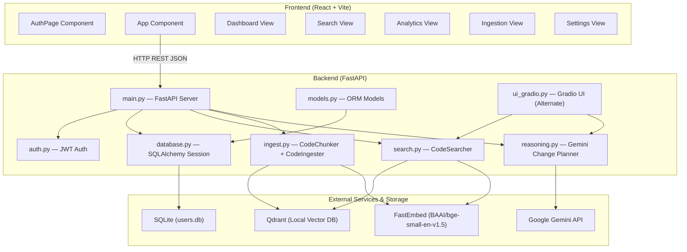
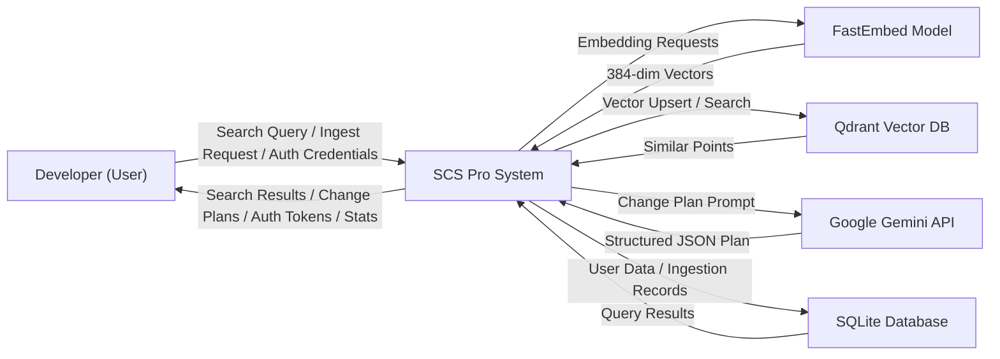
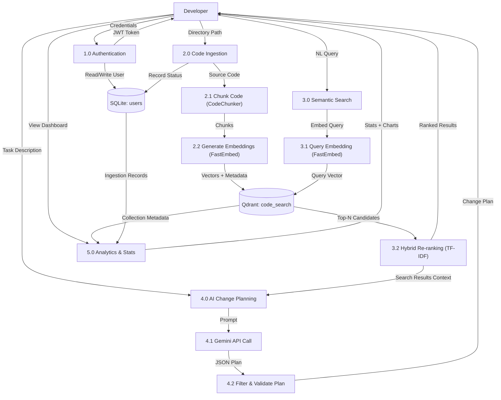
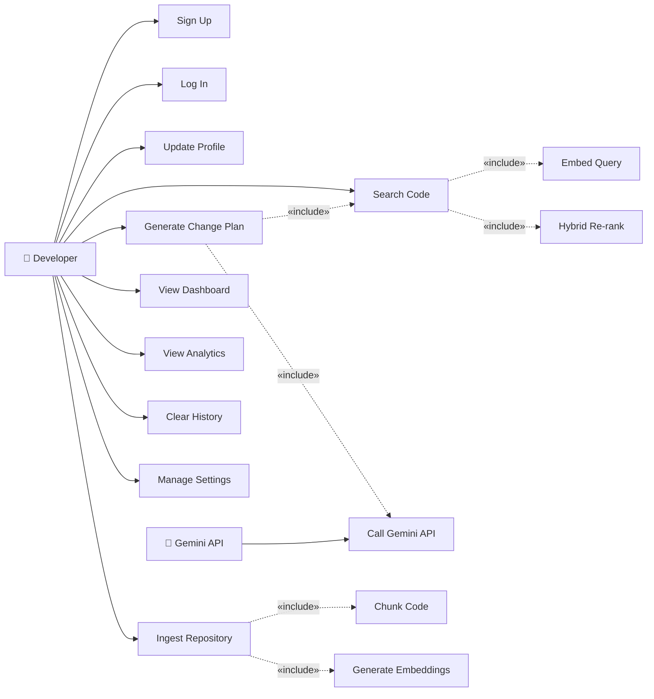

# Semantic Code Search (SCS Pro)

An AI-assisted code intelligence platform combining semantic vector search, hybrid ranking, AST-aware code ingestion, and Gemini-powered change planning.

---

## Table of Contents

- [Architecture Overview](#architecture-overview)
- [Project Structure](#project-structure)
- [Tech Stack](#tech-stack)
- [Class Relationships & Module Reference](#class-relationships--module-reference)
  - [Backend Class Diagram Reference](#backend-class-diagram-reference)
  - [Frontend Component Hierarchy](#frontend-component-hierarchy)
- [Data Flow Diagrams](#data-flow-diagrams)
  - [DFD Level 0 (Context Diagram)](#dfd-level-0-context-diagram)
  - [DFD Level 1](#dfd-level-1)
- [Use Cases](#use-cases)
- [API Reference](#api-reference)
- [Quick Start](#quick-start)

---

## Architecture Overview



---

## Project Structure

```
lablab-qdrant/
├── backend/
│   ├── main.py              # FastAPI server: endpoints, Pydantic models, CORS
│   ├── auth.py              # JWT token creation/verification, bcrypt hashing
│   ├── database.py          # SQLAlchemy engine, session factory, get_db()
│   ├── models.py            # ORM models: User, IngestionRecord
│   ├── search.py            # CodeSearcher class: hybrid semantic+lexical search
│   ├── ingest.py            # CodeChunker + CodeIngester: AST/regex parsing, embedding
│   ├── reasoning.py         # Gemini change planning: dataclasses + API calls
│   ├── ui_gradio.py         # Gradio web UI (alternate interface)
│   ├── reset_db.py          # Utility: clear SQLite + Qdrant data
│   ├── requirements.txt     # Python dependencies
│   ├── users.db             # SQLite database file
│   └── sample_project/      # Sample code for demo ingestion
│       ├── api.py
│       ├── config.js
│       ├── database.py
│       ├── utils.py
│       └── README.md
├── frontend/
│   ├── src/
│   │   ├── App.jsx          # Main SPA: all components (2084 lines)
│   │   ├── App.css          # Component-specific styles
│   │   ├── index.css        # Global Tailwind theme + custom CSS
│   │   └── main.jsx         # React entry point
│   ├── index.html           # HTML shell
│   ├── package.json         # Node dependencies (React 19, Recharts, Tailwind)
│   └── vite.config.js       # Vite configuration with React plugin
├── .env.example             # Environment variable template
├── .gitignore
├── README.md                # This file
├── QUICKSTART.md            # Condensed setup guide
├── SRS_document.md          # IEEE 830 Software Requirements Specification
└── SRS_template-ieee.doc    # Original IEEE SRS template
```

---

## Tech Stack

| Layer | Technology | Purpose |
|-------|-----------|---------|
| **Backend Framework** | FastAPI + Uvicorn | REST API server with async support |
| **Authentication** | python-jose (JWT) + passlib (bcrypt) | Token-based auth with password hashing |
| **ORM / Database** | SQLAlchemy + SQLite | User accounts, ingestion records |
| **Vector Database** | Qdrant (local mode) | Code embedding storage and cosine similarity search |
| **Embeddings** | FastEmbed (BAAI/bge-small-en-v1.5) | 384-dim vector generation, CPU-only |
| **AI Reasoning** | Google Gemini (google-genai SDK) | Structured change plan generation |
| **Alt. UI** | Gradio 4.x | Secondary web interface |
| **Frontend Framework** | React 19 + Vite 7 | SPA with hot reload |
| **Frontend Styling** | Tailwind CSS 4 | Utility-first CSS framework |
| **Charts** | Recharts 3 | Dashboard analytics visualizations |

---

## Class Relationships & Module Reference

### Backend Class Diagram Reference

This section documents every class, its attributes, methods, and inter-class relationships. Use this as the source of truth for building **UML Class Diagrams**.

---

#### `models.py` — ORM Models (SQLAlchemy)

```
┌──────────────────────────────┐
│          User                │
│──────────────────────────────│
│ - __tablename__ = "users"    │
│ - id: Integer (PK)          │
│ - name: String               │
│ - email: String (unique)     │
│ - hashed_password: String    │
│ - created_at: DateTime       │
│──────────────────────────────│
│ (inherits Base)              │
└──────────────────────────────┘

┌──────────────────────────────────┐
│       IngestionRecord            │
│──────────────────────────────────│
│ - __tablename__ = "ingestion_    │
│   records"                       │
│ - id: Integer (PK)              │
│ - repo_name: String             │
│ - directory_path: String        │
│ - files_count: Integer          │
│ - chunks_count: Integer         │
│ - status: String                │
│   ("In Progress"/"Complete"/    │
│    "Error")                     │
│ - created_at: DateTime          │
│──────────────────────────────────│
│ (inherits Base)                  │
└──────────────────────────────────┘
```

**Relationships:**
- Both `User` and `IngestionRecord` inherit from SQLAlchemy `Base` (declared in `database.py`).
- `main.py` queries both models via `Session.query()`.
- No direct foreign key relationship between `User` and `IngestionRecord` (ingestion records are global, not per-user).

---

#### `main.py` — Pydantic Request/Response Models

```
┌─────────────────────┐     ┌─────────────────────┐
│     UserSignup      │     │     UserLogin        │
│─────────────────────│     │─────────────────────│
│ + name: str         │     │ + email: EmailStr    │
│ + email: EmailStr   │     │ + password: str      │
│ + password: str     │     └─────────────────────┘
└─────────────────────┘
                              ┌─────────────────────┐
┌─────────────────────┐      │     UserUpdate       │
│    UserProfile      │      │─────────────────────│
│─────────────────────│      │ + name: Optional[str]│
│ + name: str         │      │ + email: Optional    │
│ + email: EmailStr   │      │   [EmailStr]         │
│ + role: str="User"  │      │ + password: Optional │
└─────────────────────┘      │   [str]              │
                              └─────────────────────┘
┌──────────────────────┐
│       Token          │
│──────────────────────│
│ + access_token: str  │
│ + token_type: str    │
│ + user_name: str     │
└──────────────────────┘

┌────────────────────────────────────┐
│          SearchRequest             │
│────────────────────────────────────│
│ + query: str                       │
│ + limit: int = 10                  │
│ + language: Optional[str]          │
│ + repo: Optional[str]             │
│ + chunk_types: Optional[List[str]] │
│ + min_score: float = 0.0           │
│ + sort_by: str = "relevance"       │
│ + semantic_weight: float = 0.7     │
│ + overfetch_multiplier: int = 5    │
│ + mode: str = "search"             │
└────────────────────────────────────┘

┌────────────────────────────────────┐
│          IngestRequest             │
│────────────────────────────────────│
│ + directory_path: str              │
│ + repo_name: Optional[str]        │
│ + exclude_dirs: Optional[List[str]]│
└────────────────────────────────────┘

┌────────────────────────────────────┐
│     IngestionRecordResponse        │
│────────────────────────────────────│
│ + id: int                          │
│ + repo_name: str                   │
│ + directory_path: str              │
│ + files_count: int                 │
│ + chunks_count: int                │
│ + status: str                      │
│ + created_at: datetime             │
│────────────────────────────────────│
│ Config: orm_mode = True            │
└────────────────────────────────────┘
```

**Relationships:**
- `UserSignup` → used by `POST /auth/signup`
- `UserLogin` → used by `POST /auth/login`
- `UserProfile` → returned by `GET /auth/me` and `PUT /auth/profile`
- `UserUpdate` → used by `PUT /auth/profile`
- `Token` → returned by signup and login
- `SearchRequest` → used by `POST /search`
- `IngestRequest` → used by `POST /ingest`
- `IngestionRecordResponse` → serializes `IngestionRecord` ORM model

---

#### `search.py` — CodeSearcher Class

```
┌──────────────────────────────────────────────────────────┐
│                     CodeSearcher                          │
│──────────────────────────────────────────────────────────│
│ - client: QdrantClient                                   │
│ - collection_name: str                                   │
│ - embedding_model: TextEmbedding                         │
│ - semantic_weight: float = 0.7                           │
│──────────────────────────────────────────────────────────│
│ + __init__(qdrant_url, collection_name, embedding_model) │
│ + search(query, limit, language_filter, repo_filter,     │
│          chunk_types_filter, min_score, sort_by,         │
│          semantic_weight, overfetch_multiplier) → List    │
│ - _tokenize(text) → List[str]                            │
│ - _cosine_similarity(a, b) → float                       │
│ + print_results(results)                                 │
│──────────────────────────────────────────────────────────│
│ Dependencies:                                            │
│   → QdrantClient (qdrant_client)                         │
│   → TextEmbedding (fastembed)                            │
│   → Filter, FieldCondition, MatchValue (qdrant models)   │
└──────────────────────────────────────────────────────────┘
```

**Relationships:**
- `CodeSearcher` **uses** `QdrantClient` for vector search operations.
- `CodeSearcher` **uses** `TextEmbedding` for query embedding.
- `main.py` **instantiates** one global `CodeSearcher` (`searcher`) at startup.
- `ui_gradio.py` **instantiates** its own `CodeSearcher` instances.
- `main.py` **reuses** `searcher.client` for ingestion (to avoid Qdrant concurrent writer conflict).

---

#### `ingest.py` — CodeChunker & CodeIngester Classes

```
┌───────────────────────────────────────────────────────────┐
│                      CodeChunker                           │
│───────────────────────────────────────────────────────────│
│ - max_chunk_size: int = 200                               │
│ - min_chunk_size: int = 50                                │
│───────────────────────────────────────────────────────────│
│ + __init__(max_chunk_size, min_chunk_size)                 │
│ + chunk_file(file_path, content, language) → List[Dict]    │
│ - _extract_python_structures(file_path, content)           │
│   → List[Dict]                                            │
│ - _find_end_lineno(node) → int                            │
│ - _format_function_signature(node) → str                  │
│ - _format_class_signature(node) → str                     │
│ - _extract_js_structures(content) → List[Dict]            │
│ - _extract_brace_structures(content) → List[Dict]         │
│ - _chunk_by_lines(content) → List[Dict]                   │
│ - _fill_gaps(content, existing_chunks) → List[Dict]       │
│───────────────────────────────────────────────────────────│
│ Dependencies:                                              │
│   → ast (Python stdlib)                                   │
│   → re (Python stdlib)                                    │
└───────────────────────────────────────────────────────────┘

       │ used by
       ▼

┌───────────────────────────────────────────────────────────┐
│                     CodeIngester                           │
│───────────────────────────────────────────────────────────│
│ - client: QdrantClient                                    │
│ - collection_name: str                                    │
│ - embedding_model: TextEmbedding                          │
│ - chunker: CodeChunker                                    │
│ - language_map: Dict[str, str]                            │
│───────────────────────────────────────────────────────────│
│ + __init__(qdrant_url, collection_name, embedding_model)  │
│ + detect_language(file_path) → str                        │
│ + create_collection(vector_size) → None                   │
│ + ingest_directory(directory, repo_name, exclude_dirs)    │
│   → Dict (stats)                                         │
│ + get_collection_info() → Dict                            │
│───────────────────────────────────────────────────────────│
│ Dependencies:                                              │
│   → CodeChunker (composition)                             │
│   → QdrantClient (qdrant_client)                          │
│   → TextEmbedding (fastembed)                             │
└───────────────────────────────────────────────────────────┘
```

**Relationships:**
- `CodeIngester` **composes** `CodeChunker` (creates it in `__init__`).
- `CodeIngester` **uses** `QdrantClient` and `TextEmbedding`.
- `main.py` imports `CodeChunker` directly in `run_ingestion()` (does not use `CodeIngester` to avoid opening a second Qdrant connection).
- `CodeChunker.chunk_file()` dispatches to `_extract_python_structures()`, `_extract_js_structures()`, or `_extract_brace_structures()` based on language.

---

#### `reasoning.py` — Gemini Change Planning

```
┌──────────────────────────────────────┐
│       FileChangeSuggestion           │
│   (dataclass)                        │
│──────────────────────────────────────│
│ + file_path: str                     │
│ + reason: str                        │
│ + relevant_lines: Optional[List[int]]│
└──────────────────────────────────────┘

┌──────────────────────────────────────┐
│        SuggestedChange               │
│   (dataclass)                        │
│──────────────────────────────────────│
│ + file_path: str                     │
│ + change_type: str                   │
│ + summary: str                       │
│ + important_considerations:          │
│   Optional[List[str]]                │
└──────────────────────────────────────┘

┌──────────────────────────────────────┐
│       TestUpdateSuggestion           │
│   (dataclass)                        │
│──────────────────────────────────────│
│ + file_path: str                     │
│ + reason: str                        │
└──────────────────────────────────────┘

┌──────────────────────────────────────────┐
│              ChangePlan                   │
│   (dataclass)                            │
│──────────────────────────────────────────│
│ + goal: str                              │
│ + files_to_modify: List[FileChange...]   │
│ + existing_logic_summary: str            │
│ + suggested_changes: List[Suggested...]  │
│ + tests_to_update: List[TestUpdate...]   │
│──────────────────────────────────────────│
│ + to_dict() → Dict                       │
└──────────────────────────────────────────┘

Module-level functions:
  _build_context(results, max_chars) → str
  _get_client() → genai.Client
  _strip_code_fences(text) → str
  generate_change_plan(query, results) → Dict
  _connectivity_check() → str
```

**Relationships:**
- `ChangePlan` **aggregates** `FileChangeSuggestion`, `SuggestedChange`, `TestUpdateSuggestion`.
- `generate_change_plan()` is called by `main.py` (in search endpoint with mode="plan") and `ui_gradio.py`.
- `_get_client()` creates a `genai.Client` using the `GEMINI_API_KEY` env var.

---

#### `auth.py` — Authentication Utilities

```
Module-level constants:
  SECRET_KEY: str (from env JWT_SECRET_KEY)
  ALGORITHM: str = "HS256"
  ACCESS_TOKEN_EXPIRE_MINUTES: int = 1440 (24h)
  pwd_context: CryptContext (bcrypt)

Functions:
  verify_password(plain, hashed) → bool
  get_password_hash(password) → str
  create_access_token(data, expires_delta) → str
  decode_token(token) → dict | None
```

**Relationships:**
- `main.py` **imports** all four functions from `auth.py`.
- `main.py.get_current_user()` calls `decode_token()` to validate JWT on protected endpoints.

---

#### `database.py` — Database Configuration

```
Module-level:
  engine: Engine (SQLite)
  SessionLocal: sessionmaker
  Base: declarative_base

Functions:
  get_db() → Generator[Session]
```

**Relationships:**
- `models.py` **imports** `Base` from `database.py` (all ORM models inherit it).
- `main.py` **imports** `engine` (for table creation) and `get_db` (as FastAPI dependency injection).

---

### Frontend Component Hierarchy

All components live in `frontend/src/App.jsx`:

```
App (root)
├── AuthPage                    # Login/Signup (shown when token is null)
│   └── form with email/password/name inputs
│
├── Sidebar
│   └── SidebarItem × 5        # Dashboard, Search, Analytics, Ingestion, Settings
│
├── Top Bar
│   ├── Profile Menu (dropdown)
│   └── Profile Modal
│
├── Dashboard View
│   ├── StatCard × 4            # Points, Repos, Languages, Latency
│   ├── Language Distribution Bars
│   └── RepoRow × N             # Repository list
│
├── Search View
│   ├── Query Input + Filters
│   │   └── CustomDropdown × 3  # Language, Repo, Sort
│   ├── Chunk Type Toggles
│   └── Result Cards × N
│
├── Analytics View
│   ├── BarChart (Score Distribution)
│   ├── ScatterChart (Semantic vs Lexical)
│   ├── BarChart (Symbol Frequency)
│   ├── PieChart (Languages)
│   └── LineChart (Search Latency)
│
├── Ingestion View
│   ├── Ingestion Form (path, repo name, excludes)
│   └── History Table
│
├── Settings View
│   ├── Connection Config
│   ├── Model Selection
│   ├── Search Tuning (semantic weight, overfetch)
│   └── Danger Zone (delete collection)
│
└── ConfirmationModal           # Shared modal for destructive actions
    └── useConfirm() hook       # Promise-based confirm/alert
```

**Key State Management:**
- `token` / `username` → `sessionStorage` for auth persistence
- `results` / `plan` / `analyticsData` → search results and analytics
- `stats` → dashboard data (auto-refreshed every 5s via `/info`)
- `ingestionHistory` → ingestion records (auto-refreshed every 5s when on ingestion view)

**Frontend ↔ Backend API Calls:**
- `authFetch()` wrapper adds `Authorization: Bearer <token>` to all requests
- Auto-logout on 401 response

---

## Data Flow Diagrams

### DFD Level 0 (Context Diagram)

This describes the system as a single process with external entities.



**External Entities:**
| Entity | Type | Data Exchanged |
|--------|------|----------------|
| Developer (User) | Actor | Queries, credentials, directory paths, search results, change plans, tokens |
| FastEmbed Model | Service | Text → 384-dim embedding vectors |
| Qdrant Vector DB | Data Store | Points (vectors + metadata), similarity search results |
| Google Gemini API | Service | Prompts → structured JSON change plans |
| SQLite Database | Data Store | User records, ingestion history records |

---

### DFD Level 1

This breaks the system into its major processes.



**Process Descriptions (for DFD):**

| Process | Input | Output | Description |
|---------|-------|--------|-------------|
| 1.0 Authentication | Credentials (name, email, password) | JWT Token, UserProfile | Signup/Login with bcrypt hashing and JWT generation |
| 2.0 Code Ingestion | Directory path, repo name, excludes | Indexed vectors in Qdrant, IngestionRecord in SQLite | Walks directory, chunks code, embeds, stores in Qdrant |
| 2.1 Chunk Code | Source file content + language | List of code chunks (text, lines, symbol info) | AST parsing (Python) or regex extraction (JS/Java/C++) |
| 2.2 Generate Embeddings | Code chunk text | 384-dim float vector | FastEmbed BAAI/bge-small-en-v1.5 inference |
| 3.0 Semantic Search | NL query string | Ranked code results | Embeds query, searches Qdrant, re-ranks with TF-IDF |
| 3.1 Query Embedding | Query text | 384-dim float vector | Same model as ingestion |
| 3.2 Hybrid Re-ranking | Candidates from Qdrant | Final ranked results | TF-IDF tokenization, cosine similarity, symbol boost, weighted fusion |
| 4.0 AI Change Planning | Task description + search results | Structured change plan | Builds context, calls Gemini, parses and validates JSON |
| 5.0 Analytics & Stats | Collection metadata, ingestion records | Dashboard statistics, charts | Scrolls Qdrant points, aggregates by repo/language |

**Data Stores:**

| Store | Type | Contents |
|-------|------|----------|
| SQLite: users | Relational | User accounts (id, name, email, hashed_password, created_at) |
| SQLite: ingestion_records | Relational | Ingestion logs (id, repo_name, directory_path, files_count, chunks_count, status, created_at) |
| Qdrant: code_search | Vector | Code embeddings (384-dim) + payload (file_path, code_snippet, repo_name, language, start_line, end_line, symbol_type, symbol_name, signature, docstring) |

---

## Use Cases

### Actors

| Actor | Description |
|-------|-------------|
| **Developer** | Primary user who searches code, ingests repositories, and generates change plans |
| **System** | Background processes (ingestion worker, auto-refresh timers) |
| **Gemini API** | External AI service invoked for change planning |

### Use Case Descriptions

| UC ID | Use Case | Actor | Precondition | Flow | Postcondition |
|-------|----------|-------|-------------|------|---------------|
| UC1 | **Sign Up** | Developer | Not registered | 1. Enter name, email, password → 2. System hashes password → 3. System creates User record → 4. System returns JWT token | User is authenticated |
| UC2 | **Log In** | Developer | Registered | 1. Enter email, password → 2. System verifies credentials → 3. System returns JWT token | User is authenticated |
| UC3 | **Update Profile** | Developer | Authenticated | 1. Modify name/email/password → 2. System validates uniqueness → 3. System updates User record | Profile updated |
| UC4 | **Ingest Repository** | Developer | Authenticated | 1. Enter directory path + repo name → 2. System starts background task → 3. System walks directory → 4. System chunks each file → 5. System generates embeddings → 6. System stores in Qdrant → 7. System updates IngestionRecord | Repository indexed |
| UC5 | **Search Code** | Developer | Authenticated, ≥1 repo ingested | 1. Enter NL query → 2. Optionally set filters → 3. System embeds query → 4. System retrieves candidates from Qdrant → 5. System re-ranks with TF-IDF → 6. System returns ranked results | Results displayed |
| UC6 | **Generate Change Plan** | Developer | Authenticated, ≥1 repo ingested | 1. Enter task description → 2. System performs search → 3. System builds context → 4. System calls Gemini → 5. System validates plan → 6. System returns structured plan | Change plan displayed |
| UC7 | **View Dashboard** | Developer | Authenticated | 1. Navigate to Dashboard → 2. System fetches `/info` → 3. System displays stats, language bars, repo list | Dashboard shown |
| UC8 | **View Analytics** | Developer | Authenticated, ≥1 search performed | 1. Navigate to Analytics → 2. System renders charts from cached search data | Analytics charts shown |
| UC9 | **Clear Ingestion History** | Developer | Authenticated | 1. Click clear → 2. Confirm in modal → 3. System deletes SQLite records (except "sample") → 4. System deletes Qdrant vectors (except "sample") | History cleared |
| UC10 | **Manage Settings** | Developer | Authenticated | 1. Adjust semantic weight / overfetch / model → 2. Test connection → 3. Reset or delete collection | Settings updated |

### Use Case Diagram Reference



---

## API Reference

### Authentication

| Method | Endpoint | Body | Response | Auth |
|--------|----------|------|----------|------|
| POST | `/auth/signup` | `{name, email, password}` | `{access_token, token_type, user_name}` | None |
| POST | `/auth/login` | `{email, password}` | `{access_token, token_type, user_name}` | None |
| GET | `/auth/me` | — | `{name, email, role}` | Bearer |
| PUT | `/auth/profile` | `{name?, email?, password?}` | `{name, email, role}` | Bearer |

### Search

| Method | Endpoint | Body | Response | Auth |
|--------|----------|------|----------|------|
| POST | `/search` | `{query, limit?, language?, repo?, chunk_types?, min_score?, sort_by?, semantic_weight?, overfetch_multiplier?, mode?}` | `{results: [...]}` or `{results: [...], plan: {...}}` | Bearer |

### Collection Info

| Method | Endpoint | Body | Response | Auth |
|--------|----------|------|----------|------|
| GET | `/info` | — | `{points_count, vector_size, distance, repo_count, languages, repos}` | Bearer |

### Ingestion

| Method | Endpoint | Body | Response | Auth |
|--------|----------|------|----------|------|
| POST | `/ingest` | `{directory_path, repo_name?, exclude_dirs?}` | `{message, record_id}` | Bearer |
| GET | `/ingestion-history` | — | `[{id, repo_name, directory_path, files_count, chunks_count, status, created_at}]` | Bearer |
| DELETE | `/ingestion-history` | — | `{message}` | Bearer |

### Debug

| Method | Endpoint | Body | Response | Auth |
|--------|----------|------|----------|------|
| GET | `/debug-clear` | — | `{message, total_scanned}` | None |

---

## Quick Start

### Prerequisites

- Python 3.10+
- Node.js 18+

### 1. Clone & Configure

```bash
git clone https://github.com/alijafarkamal/Semantic-Code-Search-using-Qdrant.git
cd Semantic-Code-Search-using-Qdrant
cp .env.example .env
# Edit .env and set your GEMINI_API_KEY
```

### 2. Backend Setup

```bash
cd backend
pip install -r requirements.txt
python main.py
# Server starts at http://localhost:8000
```

Notes:
- The backend serves the API at port 8000; the browser-facing homepage is the frontend app.
- Gemini is optional for normal search and auth. If you do not have a `GEMINI_API_KEY`, plan mode falls back to a local heuristic plan.

### 3. Frontend Setup

```bash
cd frontend
npm install
npm run dev
# App starts at http://localhost:5173
```

### 4. Ingest Sample Project

Use the UI's Ingestion tab or call the API:

```bash
curl -X POST http://localhost:8000/ingest \
  -H "Content-Type: application/json" \
  -H "Authorization: Bearer <your-jwt-token>" \
  -d '{"directory_path": "./sample_project", "repo_name": "sample"}'
```

---

## License

Open source — available for use.
